<div align="center">


<br/>

**The user infrastructure platform.**

Hexclave handles everything around your users: authentication, teams,
payments, emails, analytics, and much more. Start in minutes on the hosted
cloud. Your data is always yours to export and self-host.

[Website](https://hexclave.com) · [Docs](https://docs.hexclave.com) · [Dashboard](https://app.hexclave.com) · [Discord](https://discord.hexclave.com)


</div>

---

<div align="center">
  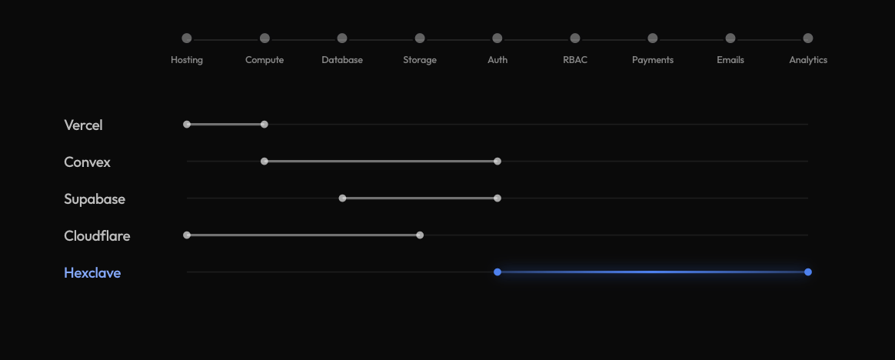
</div>

## Get started

Setting up Hexclave is one prompt. Paste this into your coding agent of choice:

```text
Read skill.hexclave.com and help me setup hexclave in this project
```

## What's included

Hexclave ships as a catalog of apps you switch on as your product needs them.
Each one is built on the same user model, and new apps land regularly.

<table><tr>
<td width="50%" valign="middle">

###  &nbsp; Authentication

Authentication that just works with passkeys, OAuth, and CLI auth. Drop in one component and ship the whole flow; auth methods toggle from the dashboard with no code changes needed.

</td>
<td width="50%" valign="middle" align="center">
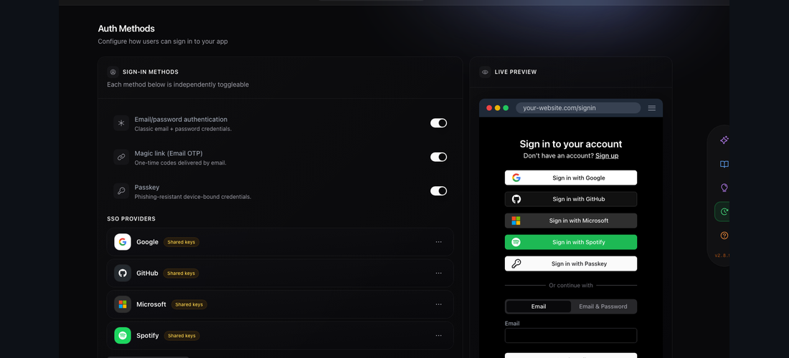
</td>
</tr></table>

<table><tr>
<td width="50%" valign="middle">

###  &nbsp; Teams

Build for teams, not just users, with workspaces, email invites, and roles that actually gate the work. The workspace switcher remembers selection, invites auto sign up new users, and permissions hold up under audit.

</td>
<td width="50%" valign="middle" align="center">
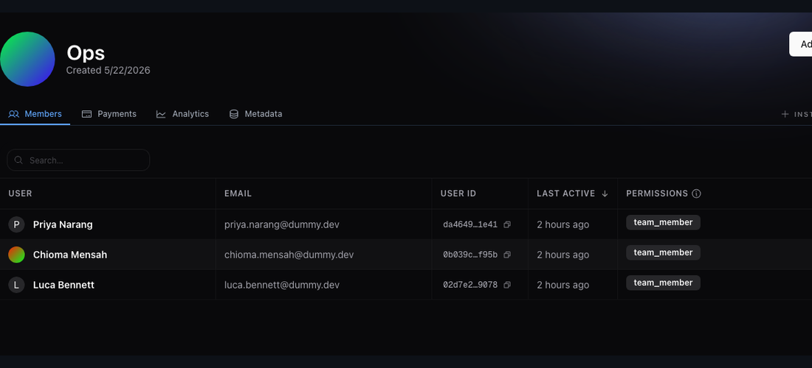
</td>
</tr></table>

<table><tr>
<td width="50%" valign="middle">

###  &nbsp; RBAC

Permissions, sorted: roles that nest and one permission check that works the same on server or client. Define them in the dashboard, check them anywhere in your code.

</td>
<td width="50%" valign="middle" align="center">
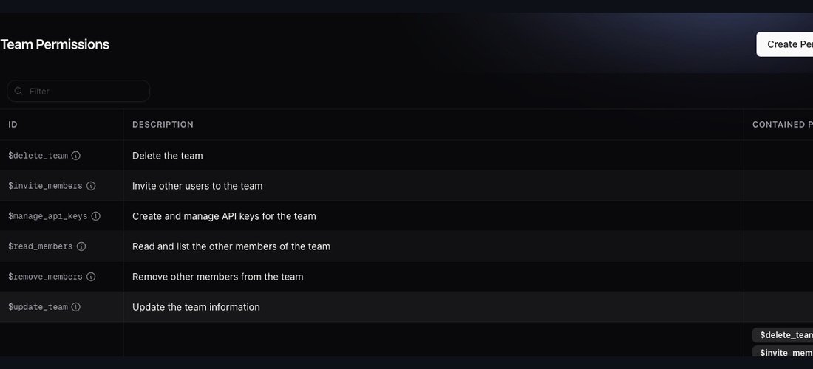
</td>
</tr></table>

<table><tr>
<td width="50%" valign="middle">

###  &nbsp; API Keys

API keys without the footguns: leaked keys get auto-revoked, work for users and teams, and show the full secret only once. We never keep the plaintext after creation.

</td>
<td width="50%" valign="middle" align="center">
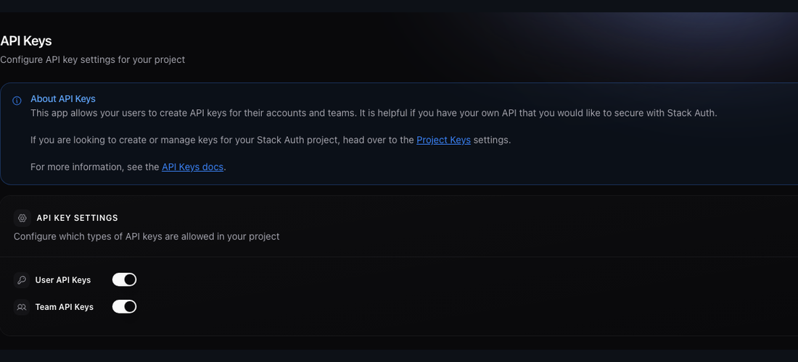
</td>
</tr></table>

<table><tr>
<td width="50%" valign="middle">

###  &nbsp; Payments

Payments without the plumbing for subscriptions, one-time charges, and usage metering with credits. Bill a person or a whole team with one model, no separate codepath.

</td>
<td width="50%" valign="middle" align="center">
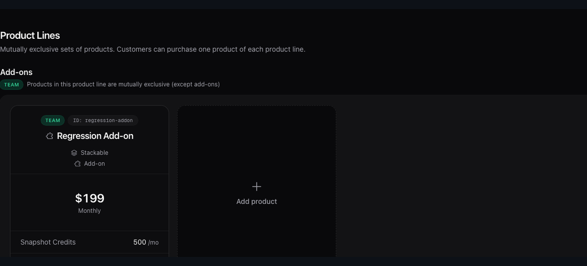
</td>
</tr></table>

<table><tr>
<td width="50%" valign="middle">

###  &nbsp; Emails

Email that delivers and tells you so, handling transactional and marketing sends from one API. Edit templates with an AI editor, theme once, and track every open and click.

</td>
<td width="50%" valign="middle" align="center">
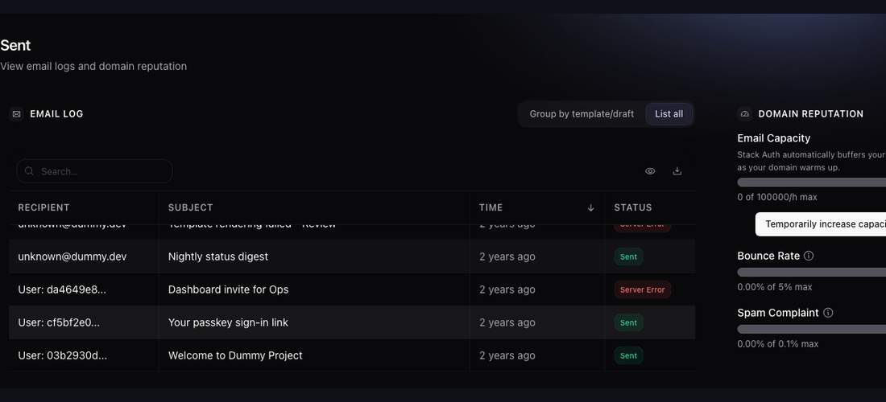
</td>
</tr></table>

<table><tr>
<td width="50%" valign="middle">

### 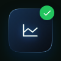 &nbsp; Analytics

Know your users with no data stack required, with live active user counts and session replays out of the box. Ask in plain English to build dashboards or write SQL to save queries, all with one flag enabled.

</td>
<td width="50%" valign="middle" align="center">
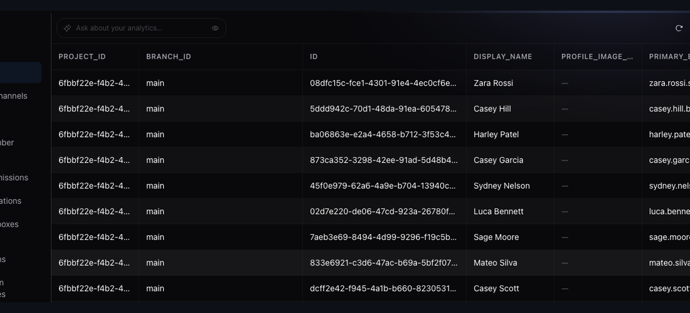
</td>
</tr></table>

<table><tr>
<td width="50%" valign="middle">

###  &nbsp; Webhooks

React to every user event in real time with signed, tamper-proof webhooks. Retries and backoff are handled for you; verify in five lines and manage endpoints from the dashboard.

</td>
<td width="50%" valign="middle" align="center">
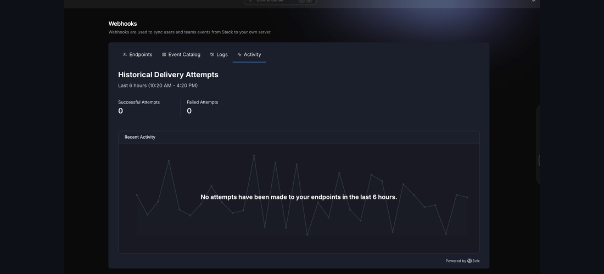
</td>
</tr></table>

<table><tr>
<td width="50%" valign="middle">

###  &nbsp; Data Vault

A safe for the secrets your users hand you, locked with your secret so we never see the plaintext. Store and retrieve tokens in two lines each, server-only by design.

</td>
<td width="50%" valign="middle" align="center">
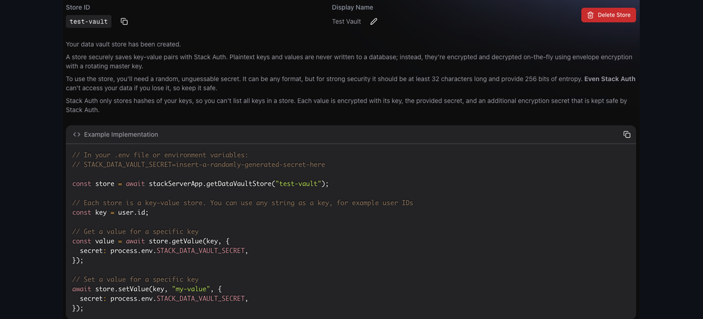
</td>
</tr></table>

<table><tr>
<td width="50%" valign="middle">

###  &nbsp; Launch Checklist

Run through the must-do checks before flipping to production: domain setup, callbacks locked, secrets rotated. The progress tracker keeps your team aligned so nothing critical slips through on launch day.

</td>
<td width="50%" valign="middle" align="center">
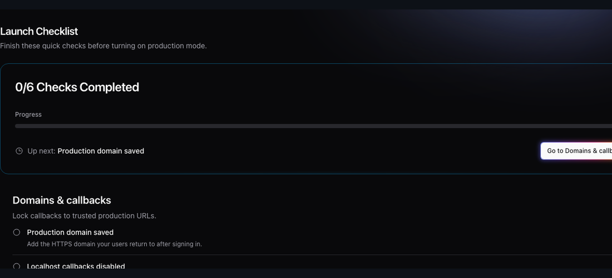
</td>
</tr></table>

## Contributing

Hexclave is open source, and contributions are welcome. Read
[`CONTRIBUTING.md`](./CONTRIBUTING.md) to get started, and say hello in
[Discord](https://discord.hexclave.com) before picking up anything large.
Found a security issue? Email security@hexclave.com.

## ❤ Contributors

<a href="https://github.com/hexclave/stack-auth/graphs/contributors">
  
</a>
